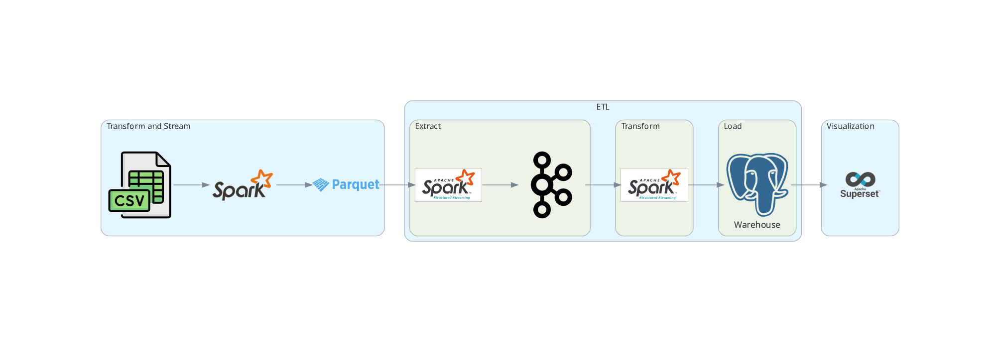
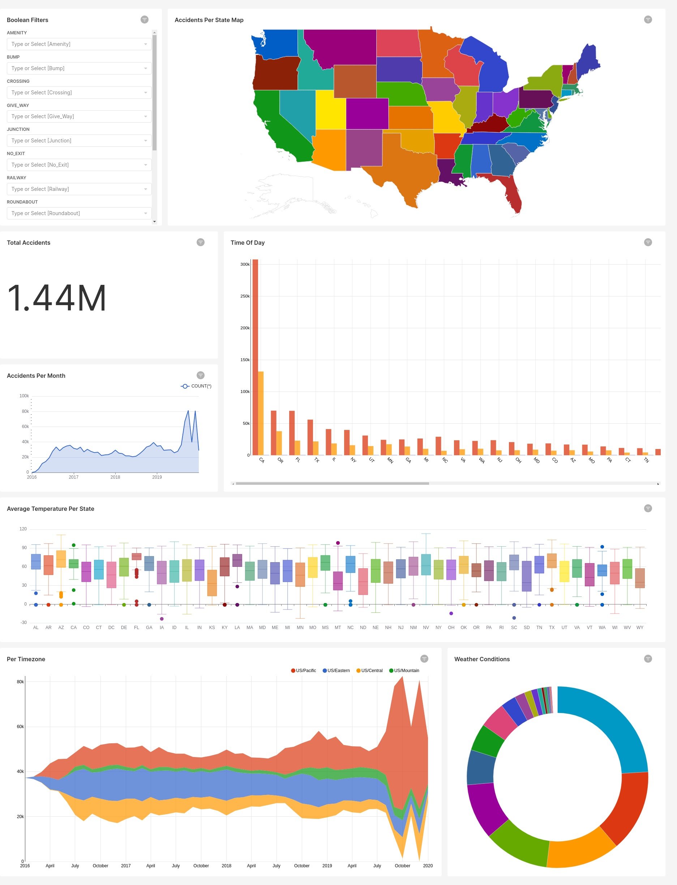

# US-accidents-analysis

## Summary

A Data Engineering project to analyse US accidents and visualize them.

 I wanted this project to have a streaming data source, but unfortunately must of the APIs are for crypto and finance. So instead I decided to stream a dataset based on time columns.

The dataset comes from [Kaggle](https://www.kaggle.com/datasets/sobhanmoosavi/us-accidents), which has a `Start_Time` and an `End_Time` columns.

## Initial design
The initial plan was that the processing will be done with Pyspark, the data will be streamed to Kafka Topic, written to a MongoDB collection, then to a PostgreSQL data warehouse and finally visualized with Superset.

I also wanted to include Kafka Streams, but it is not supported in Python. So I tried Faust; however, Faust's read is extremely slow compared to Kafka's write speed. The faust code snippet is included in this Repo. Also, mongoDB could not handle the high volume high velocity write which caused latency that reached up to 10 mins while streaming over 1 hour duration. Therefore, I ditched MongoDB for this project and streamed the data directly from Kafka to PostgreSQL.

## Project architecture

## Final dashboard

